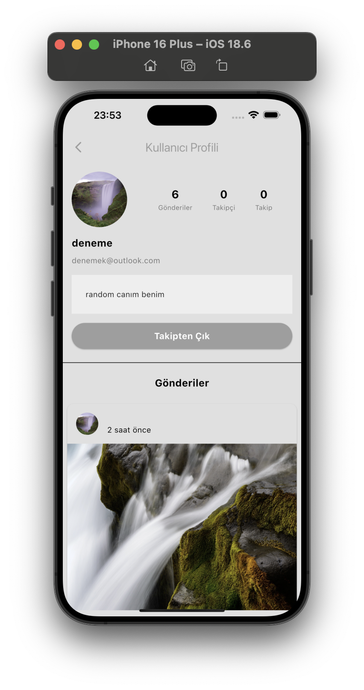
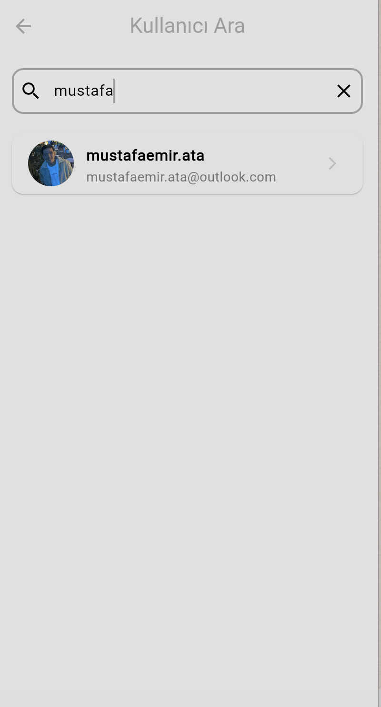
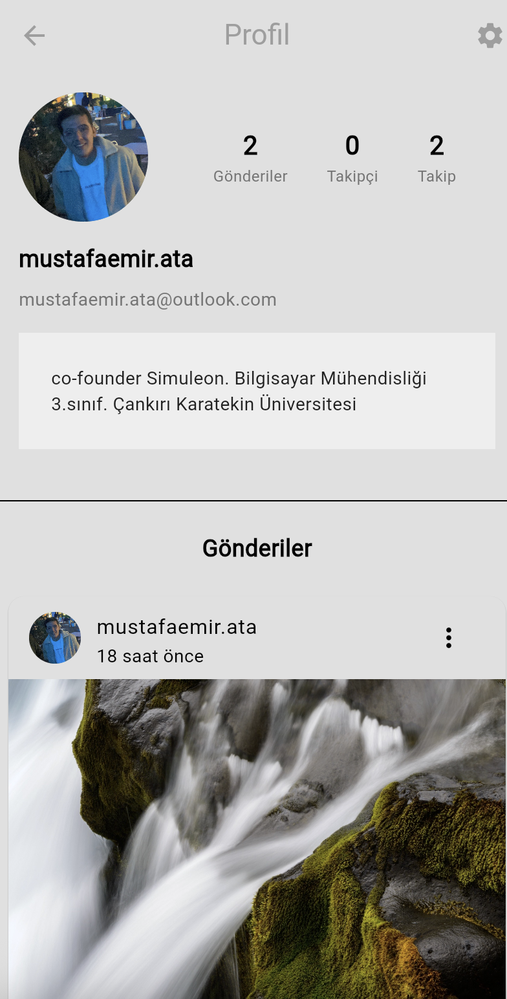
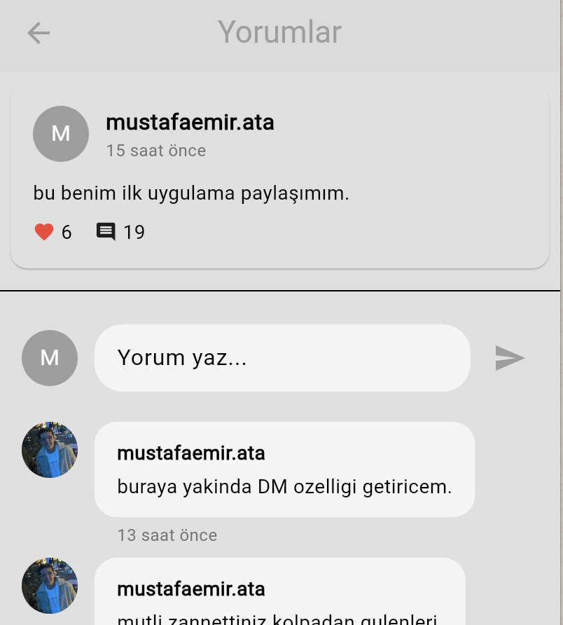

# Social

Bu proje **Instagram Clone App**'tir.

## Proje Hakkında

Sosyal medya uygulaması olarak tasarlanmış bu proje, Instagram benzeri temel işlevleri içermektedir. Kullanıcılar gönderi oluşturabilir, yorum yazabilir, biyografilerini düzenleyebilir ve takipçi/takip edilen sayısını görebilirler.

## Özellikler

- Gönderi oluşturma
- Yorum yapma
- Profil biyografisi düzenleme
- Takipçi ve takip edilen sayısı gösterme
- Kullanıcı arama

## Ekran Görüntüleri

Ana dizinde bulunan görseller:

### Profil


### Ana Sayfa


### Aramalarım


### Profilim


### Yorumlarım


## Kullanım

Projeyi kendi ortamınızda çalıştırmak için:

1. Depoyu klonlayın:
   ```bash
   git clone https://github.com/mustafaemirata/social.git
